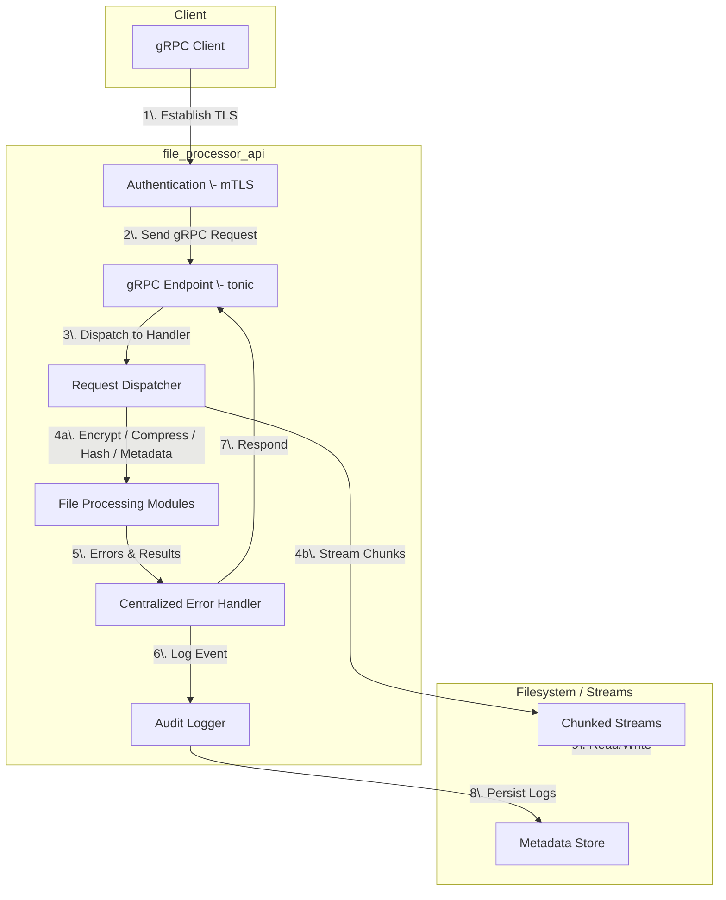

## Overview
About
File processor API is a Rust binary that exposes a gRPC endpoint secured by mutual TLS, ment for integration with C#, Java, and C++ backends. It processes file‑transform commands—encrypt/decrypt, compress/decompress, hash, and metadata extraction/modification—via asynchronous Rust runtimes. All logic is encapsulated in a centralized error handler.

## Features Plan
### Compression and Decompression
Compression and decompression will be implemented using `zstd` and `flate2` crates.

### Encryption and Decryption
Encryption and decryption will be implemented via AES‑GCM (`openssl` or `rustls` crates).

### Hashing
Hashing will use `blake3` for fast, incremental digests.

### Metadata Handling
Metadata extraction and modification will leverage `std::fs::Metadata`.

### Chunked Streaming
Chunked streaming will use `tokio::io::AsyncReadExt`/`AsyncWriteExt` for zero‑copy.

### Logging and Auditing
Logging using `log` + `env_logger`; audit logs will record request IDs, timestamps, and outcomes.

### Centralized Error Handling
All operations will yield `Result<T, ApiError>` via a custom `thiserror`‑based error enum.

### CI Pipeline
GitHub Actions configured for build, test, Clippy, and security scans (Coverity, SonarCloud).

## License
Apache-2.0 license
