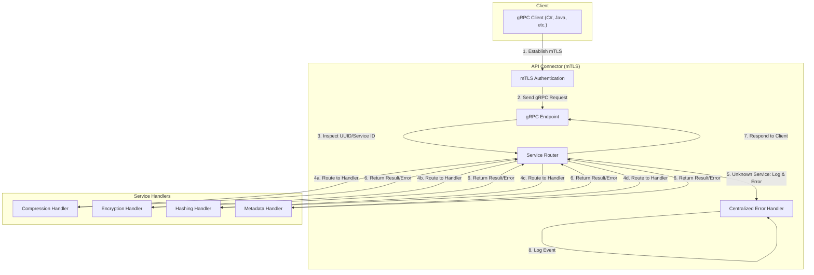

# API Connector Module Documentation

## Overview
The API Connector is a modular gRPC entrypoint for the file_processor_api service. It is responsible for:
- Accepting incoming gRPC requests over mTLS.
- Inspecting the first digit or UUID of each request to determine which service/component is being requested.
- Routing the request to the correct handler module (e.g., compression, encryption, hashing, metadata, etc.).
- Returning an error code and logging a minor user error if the UUID/service is unknown or unsupported.
- Delegating all error and audit logging to the centralized error handler.

The API Connector itself does not process files or perform business logic; it only routes requests securely and efficiently.

## Architecture

## Routing Logic
- The API Connector inspects the first digit or UUID of each request.
- If the UUID/service ID matches a known handler, the request is routed to that handler.
- If the UUID/service ID is unknown, the API Connector:
  - Returns a specific error code to the client (e.g., `ERR_UNKNOWN_SERVICE`).
  - Logs the event as a minor user error in the error handler, with full context (user/session/request info).

## Error Handling
- All errors, including unknown service requests, are logged via the centralized error handler.
- Minor user errors (e.g., invalid UUID) are logged with severity `Warning Minor (WM)`.
- Audit logs include user ID, session ID, request ID, and error context.

## mTLS Security
- All gRPC connections are secured with mutual TLS (mTLS).
- Only authenticated clients can send requests.

## Example gRPC Flow
1. Client establishes mTLS connection to API Connector.
2. Client sends a gRPC request with a UUID/service ID.
3. API Connector inspects the UUID/service ID:
   - If valid, routes to the correct handler.
   - If invalid, returns error and logs the event.
4. Handler processes (or mocks) the request and returns a result or error.
5. API Connector responds to the client.

## Extensibility
- New handlers can be added by registering their UUID/service ID and implementing the handler trait.
- The router logic is easily extensible for new services.

## Test Coverage
- Tests should cover:
  - Valid routing to each handler.
  - Error path for unknown UUID/service ID.
  - Logging of minor user errors.
  - mTLS handshake and secure communication.

---

This modular API Connector design ensures secure, auditable, and maintainable routing for all file processing requests in the file_processor_api system.
